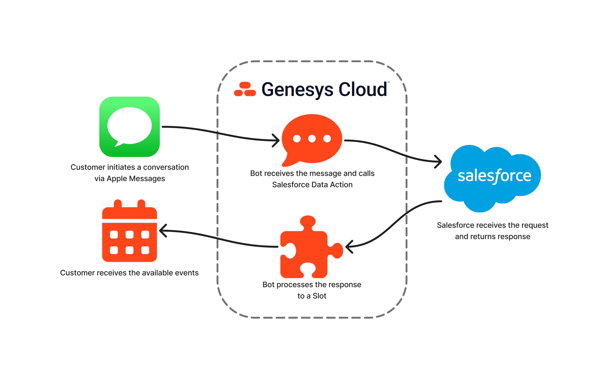

# Integrate Apple Messages for Business Bot Flows on Genesys Cloud with Salesforce

This Genesys Cloud Developer Blueprint explains how to integrate a digital bot flow controlling an Apple Messages for Business conversation with a third-party calendar system. This integration enables bot developers to easily retrieve, transform and present calendar information to consumers via the Time Picker message type.

The blueprint [documentation can be seen here](blueprint/index.md "Goes to the blueprint documentation").
