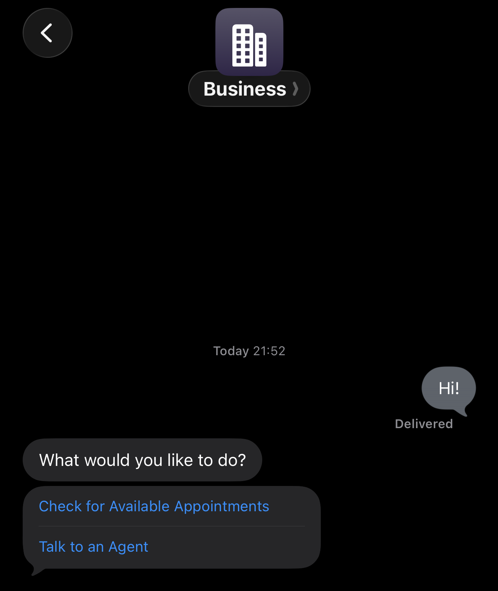
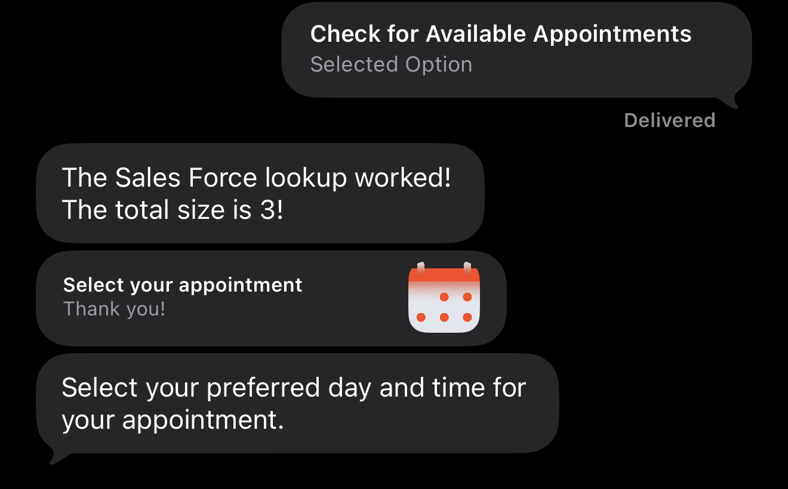

This Genesys Cloud Developer Blueprint explains how to integrate a digital bot flow controlling an Apple Messages for Business conversation with a third-party calendar system. This integration enables bot developers to easily retrieve, transform and present calendar information to consumers via the Time Picker message type.


## Scenario

A consumer using an Apple iOS device engages with a brand to book an appointment within a set number of days. The brand’s digital bot flow uses a data action to connect to a Salesforce calendar system to check for available appointments. The digital bot flow parses the data returned from Salesforce, writing the appointments to a timeslot. The bot flow then presents these options to the consumer via an “Ask for Slot” action. This action is configurable, enabling the bot author to present highly stylized received and reply messages with images, titles, subtitles and even location.

## Solution Components

* **Apple Messages for Business**: a customer communication platform that lets businesses connect with consumers directly through the native Messages app on iOS devices, enabling secure, branded, and interactive conversations.
Genesys Cloud: A suite of Genesys Cloud services for enterprise-grade communications, collaboration, and contact center management. In this solution, you use an Apple Messages integration, an Architect digital bot flow and a data action.
* **Salesforce**: A cloud-based CRM platform. In this scenario we use Salesforce’s Calendar API to retrieve calendar events.
* **Genesys Cloud**: A suite of services for enterprise-grade communications, collaboration, and contact center management.
  * **Architect Digital Bot Flow**: A web-based design tool, controlling how Genesys Cloud handles inbound or outbound interactions. In this solution, an inbound message flow precedes a digital bot flow. The bot flow is used to connect to the third party system and to compose the time picker message.
  * **Data Action**: A secure integration tool that enables brands to connect to third party systems within Genesys Architect flows.

## Prerequisites

* Specialized Knowledge
  * Administrator-level knowledge of Genesys Cloud.
  * Basic knowledge of Genesys Cloud Architect.
  * Basic knowledge of the Genesys Cloud Data Actions.
  * Basic knowledge of Salesforce.
* Genesys Account Requirements
  * A Genesys Cloud license (CX 1 Digital or greater). For more information, see [Genesys Cloud Pricing](https://www.genesys.com/pricing "Goes to the Genesys Cloud Pricing page").
  * Master Admin role in Genesys Cloud or permissions to access Architect, Integrations. For more information, see [Roles and permissions overview](https://help.genesys.cloud/?p=24360 "Goes to the roles and permissions overview in the Genesys Cloud Resource Center") in the Genesys Cloud Resource Center.
* Salesforce Account Requirements
  * A Salesforce CRM account with calendar events exposed via the Calendar API.
* Apple Messages for Business Account Requirements
  * An account in the Apple Business Register with access to Messages for Business.
  * A Messages configuration pointing consumers to Genesys as the MSP.

## Implementation Steps

* [Clone the repository _(Optional)_](#clone-the-repository "Goes to the Clone the Repository section")
* [Create the Salesforce Integration](#create-the-salesforce-integration "Goes to the Create the Salesforce Integration section")
* [Create and Import the Data Action](#create-and-import-the-data-action "Goes to the Create and Import the Data Action section")
* [Create and Import the Digital Bot Flow](#create-and-import-the-digital-bot-flow "Goes to the Create and Import the Digital Bot Flow section")
* [Create the Inbound Message Flow](#create-the-inbound-message-flow "Goes to the Create the Inbound Message Flow section")
* [Create the Apple Messages Platform Integration](#create-the-apple-messages-platform-integration "Goes to the Create the Apple Messages Platform Integration section")
* [Route the Inbound Message Flow to the Apple Messages Integration](#route-the-inbound-message-flow-to-the-apple-messages-integration "Goes to the Route the Inbound Message Flow to the Apple Messages Integration section")
* [Testing](#testing "Goes to the Testing section")

## Clone the Repository

Clone the [apple-messages-salesforce-time-picker-blueprint](https://github.com/GenesysCloudBlueprints/apple-messages-salesforce-time-picker-blueprint "Goes to the apple-messages-salesforce-time-picker-blueprint repository in GitHub") repository in your local machine. You can also run this git command to clone the repository:

```bash
git clone https://github.com/GenesysCloudBlueprints/apple-messages-salesforce-time-picker-blueprint.git
```

The repository contains the data action and digital bot flow for the implementation.

## Create the Salesforce Integration

Create a Salesforce integration by [following the instructions in this article](https://help.genesys.cloud/articles/add-a-data-actions-integration/#tab6 "Goes to the Genesys Cloud Resource Center article"). Do take note that you'll need to provide the Salesforce user credentials, Security Token, and the Login URL used to login to the given account.

The integration page can be seen in **IT and Integrations** > **Integrations**.


## Create and Import the Data Action

The Data Action to import (in JSON format) is in the `/exports` folder in the [blueprint repository](#clone-the-repository "Goes to the Clone the Repository section") named `GetEventsDataAction.json`. You can also get the file directly here: [GetEventsDataAction.json](https://github.com/GenesysCloudBlueprints/scheduling-bot-blueprint/blob/main/exports/GetEventsDataAction.json "Goes to the GetEventsDataAction.json file in GitHub")

You can import the data action using the following steps:

1. In Genesys Cloud, navigate to **IT and Integrations** > **Integrations** > **Actions** and click **Import**.
2. Select the json file and associate with your [recently created Salesforce Integration](#create-the-salesforce-integration "Goes to the Create the Salesforce Integration section").
3. Click **Import Action**.
4. Click **Save & Publish**.

## Create and Import the Digital Bot Flow

1. In Genesys Cloud, navigate to **Orchestration** > **Architect** > **Flows:Digital Bot Flow** and click **Add**.

2. Enter a name for the inbound message flow and click **Create Flow**.

3. From the **Save** menu, click **Import**.

4. Select the `AppleMessagesSalesforceDigitalBot.i3BotFlow` file from `/exports` or you can [get it here](https://github.com/GenesysCloudBlueprints/scheduling-bot-blueprint/blob/main/exports/AppleMessagesSalesforceDigitalBot.i3BotFlow "Goes to the AppleMessagesSalesforceDigitalBot.i3BotFlow file in GitHub") and click **Import**.

5. Ensure that the data actions in the bot flow are connected to the [data actions you just created](#create-and-import-the-data-action "Goes to the Create and Import the Data Action section") and have the given Inputs and Success Outputs. Ensure that the `ownerId` is set to the events created or organized to the targeted user. The queue should also be changed to the queue that you want the flow to be routed to when the user selects the "Talk to an Agent" option.

6. Click **Save** and then click **Publish**.


:::primary
**Note**: You can adjust the `Flow.dayrange` depending on what dates you want the user wants to see. The date range will be from today until the number of days you will set. Take note that the Salesforce REST API endpoint used in the data action only accepts time in UTC only.
:::

:::primary
**Important**: Since this blueprint only shows how the retrieved Salesforce events are transformed to a Timeslot collection, it is up to you on what to do with the selected Timeslot of the user. You can create and call another data action to edit the event to add a participant, reserve it to the user, etc.
:::

## Create the Inbound Message Flow

1. In Genesys Cloud, navigate to **Orchestration** > **Architect** > **Flows:Inbound Message** and click **Add**.

2. Enter a name for the inbound message flow and click **Create Flow**.

3. Add a **Call Digital Bot Flow** at the start of the flow and choose the [Digital Bot Flow you just created](#create-and-import-the-digital-bot-flow "Goes to the Create and Import the Digital Bot Flow section").


## Create the Apple Messages Platform Integration

To integrate Apple Messages for Business with Genesys Cloud, follow **Steps 1-4** of the [Configure ACD for Apple integrations](https://help.genesys.cloud/articles/configure-acd-for-apple-integrations/ "Goes to the Configure ACD for Apple integrations article") article. You can also set up the integration manually via Genesys Cloud UI and the instructions are located in **Step 4 Notes** of the article.


## Route the Inbound Message Flow to the Apple Messages Integration

1. Go to **Orchestration** > **Routing** > **Message Routing**.
2. Click **Attach New Addresses to a Flow**.
3. Choose the [Inbound Message Flow you just created](#create-the-inbound-message-flow "Goes to the Create the Inbound Message Flow section") and on the **Select Addresses**, select the [Apple Messages Platform Integration that you just created](#create-the-apple-messages-platform-integration "Goes to the Create the Apple Messages Platform Integration section").


## Testing

:::primary
**Note:** Before testing, ensure that you have created calendar events by the user you put in the Data Action in the Digital Bot Flow.
:::

To test the flow you may test it in Architect with the [Digital Bot Flow](#create-and-import-the-digital-bot-flow "Goes to the Create and Import the Digital Bot Flow section") by clicking the **Test** Button.


You can also test it in your Apple devices by following the Step 5 of the [Configure ACD for Apple integrations](https://help.genesys.cloud/articles/configure-acd-for-apple-integrations/ "Goes to the Configure ACD for Apple integrations article") article.

1. Start the conversation by sending a message. The bot will then ask on "what would you like to do?"
2. Choose **Check for Available Appointments**
3. The bot will then show the available appointments. You can then choose the appointment you want.





## Additional Resources

* [Onboarding with Apple Messages for Business](https://register.apple.com/resources/messages/messaging-documentation/end-to-end "Goes to the Onboarding with Apple Messages for Business article in Apple website")
* [Configure ACD for Apple integrations](https://help.genesys.cloud/articles/configure-acd-for-apple-integrations/ "Goes to the Configure ACD for Apple integrations article at the Genesys Cloud Resource Center")
* [Inbound Message flows overview](https://help.genesys.cloud/articles/inbound-message-flows/ "Goes to the Inbound Message flows overview article at the Genesys Cloud Resource Center")
* [About Genesys Digital Bot Flows](https://help.genesys.cloud/articles/about-genesys-digital-bot-flows/ "Goes to the About Genesys Digital Bot Flows article at the Genesys Cloud Resource Center")
* [About the Salesforce data actions integration](https://help.genesys.cloud/articles/about-salesforce-data-actions-integration/ "Goes to the About the Salesforce data actions integration article at the Genesys Cloud Resource Center")
* [About Salesforce Event Object](https://developer.salesforce.com/docs/atlas.en-us.object_reference.meta/object_reference/sforce_api_objects_event.htm "Goes to the Salesforce Event Object at Salesforce Developers")
